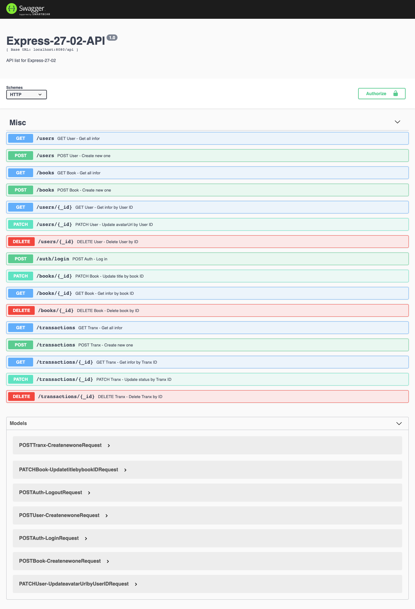

# codersX-Express-27 - Exercise 2
Bạn quyết định làm đầy đủ chức năng cho mobile app. Hãy viết các endpoint còn lại theo suy nghĩ của bạn.

## API list:

Resource|POST create|GET read|PUT update|DELETE delete|
:-|:-:|:-:|:-:|:-:|
`/auth/login`|log in|-|-|-|
`/auth/logout`|log out|-|-|-|
`/books`|add a new book|info all books|-|-|
`/books/:_id`|-|list info of this book|update this book title|delete this book|
`/transactions`|add new trx|get all trx|-|-|
`/transactions/:_id/`|-|list info of this trx|update status this trx|delete this trx|
`/users`|add new user|list all users|-|-|
`/users/:_id/`|-|list info of this user|update user info|delete this user|

## POSTMAN link summary
 

# codersX-Express-27 - Exercise 3
Nghiên cứu Swagger để viết API documentation gửi cho anh bạn mobile engineer kia. Lưu lại những gì bạn viết vào một file gist và submit.

Bài giải [Link Gist](https://gist.github.com/longpos222/f48b01d34f371d72e55d039e09791dc9)

Screenshot API Page

